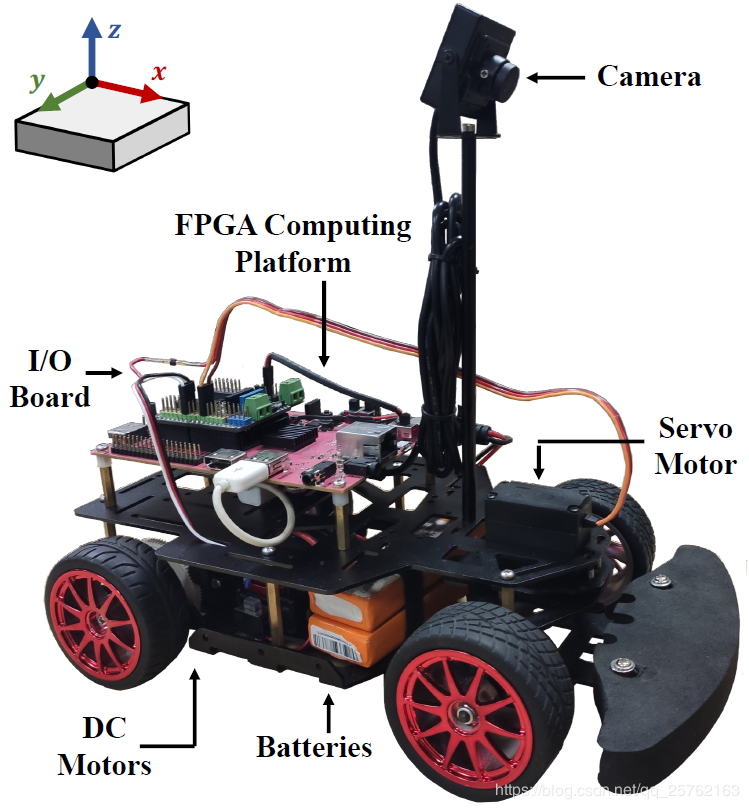
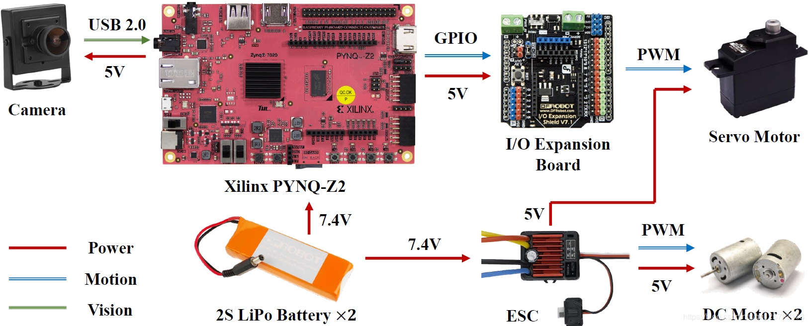
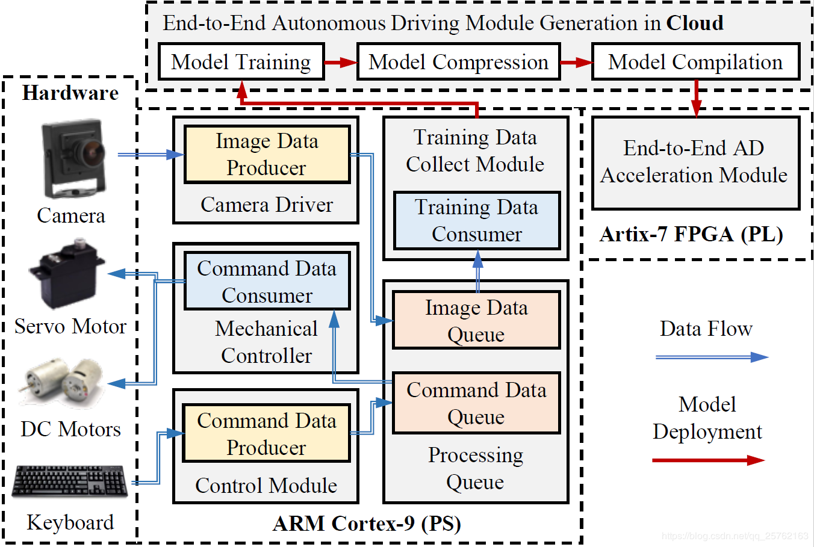
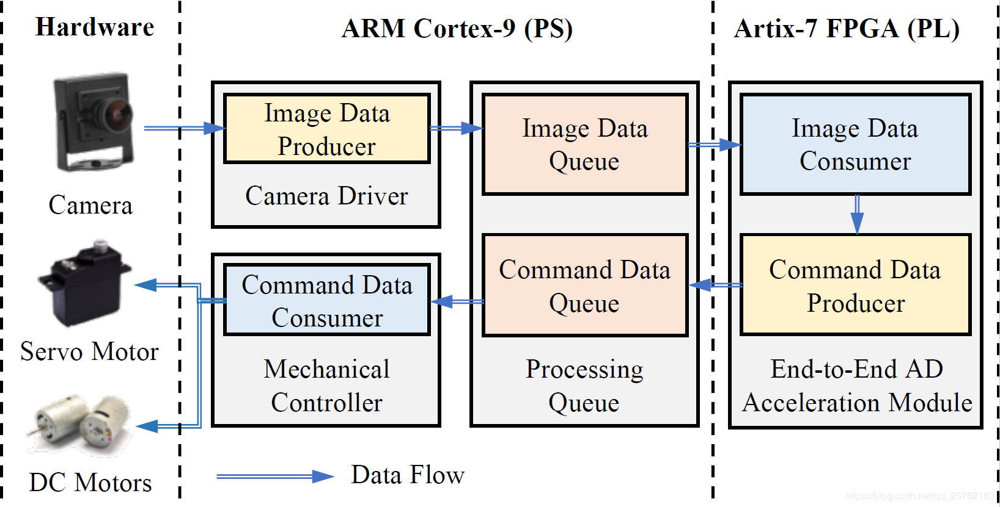
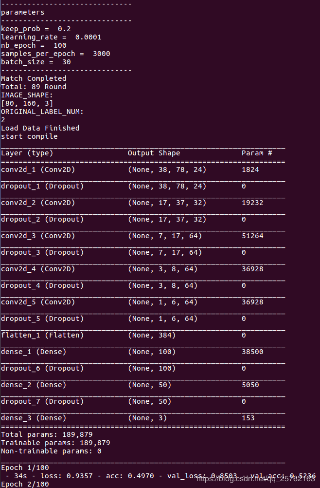
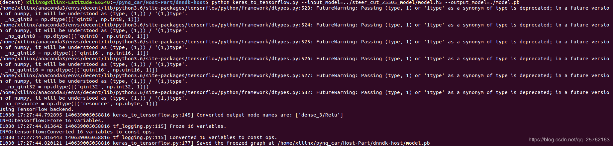
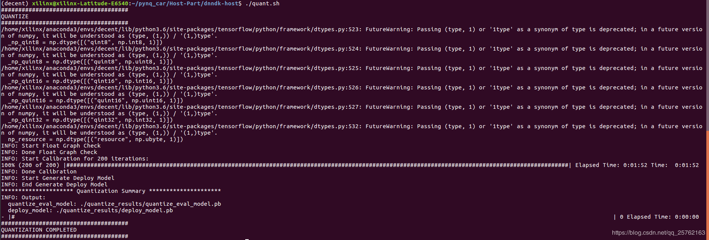
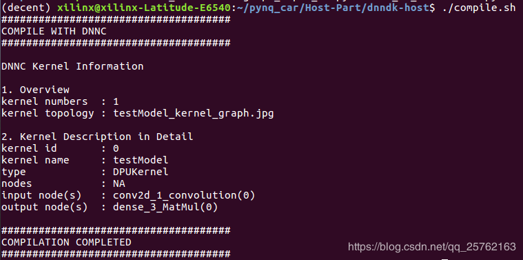

# 前言
HydraMini是Xilinx推出的基于Pynq-Z2开发板和Xilinx Edge AI解决方案的自动驾驶小车，其有着简单易学、高灵活性、高扩展性、高性能等优良特性，是研究人员和学生进入自动驾驶领域的一个平台。本教程会通过最基础的讲解和步骤带领读者熟悉平台的基本开发流程。详细的代码解读和流程分析见参考链接里的github项目。
<p align="center">

</p>
<p align = "center">
</p>

<p align="center">

</p>
<p align = "center">
</p>
小车采用两块电池给板子以及电机供电，通过单目摄像头感知环境。

# 环境配置
1. PC端：下载Xilinx提供的Ubuntu16.04+DNNDK镜像。如果想自行配置请参考[Host端配置](https://github.com/wutianze/dnndk-pynqz2/blob/master/build-host-dnndk.md)
2. Pynq-Z2端：下载Xilinx提供的[Pynq-Z2+HydraMini小车系统](https://pan.baidu.com/s/1gOJaoJJ8z2jf-BaLklID3Q)并烧录到SD卡。如果想自行配置请参考[Pynq端配置](https://github.com/wutianze/dnndk-pynqz2/blob/master/build-pynqz2-system.md)
3. 跑道搭建：使用胶带或其他材料模仿一般的道路搭建环形跑道，尽量保持左转和右转频率一样多，比如下图所示8字形跑道。
<p align="center">

</p>
<p align = "center">
</p>

# 基础知识
在继续阅读后续教程前，笔者推荐掌握或熟悉的知识：
1. C++ & Python3
2. Ubuntu Linux使用
3. Keras + Tensorflow基本用法
# 介绍
- 训练流程。首先控制小车采集数据，然后使用keras框架进行训练并把保存的模型转化为tensorflow模型，最后通过DNNDK套件进行量化编译得到最终可以在DPU上运行的核文件。
<p align="center">

</p>
<p align = "center">
</p>
- 运行流程。运行时从摄像头采集数据，然后送入模型推理，经由Xilinx DPU加速后，模型输出控制指令控制小车运动。
<p align="center">

</p>
<p align = "center">
</p>
- 源代码目录结构
	- Host-Part
		- process_img.py # 图像预处理
		- process_train.sh # 图像预处理加训练脚本
		- train.py # 模型训练
		- dnndk-host # DNNDK量化编译目录
			- compile.sh # 编译
			- quant.sh # 量化
			- graph_input_fn.py # 量化输入数据生成器
			- keras_to_tensorflow.py # keras模型转tensorflow模型脚本
			- freeze_detect.sh # 模型转换并显示输入输出层信息脚本
	- Pynq-Part/Car
		- src
			- collect.cc # 收集训练数据
			- run.cc # 小车运行
			- run_fpt.cc # 本教程中用不到
			- runYolo.cc # 本教程中用不到
			- runYolo.h # 本教程中用不到
			- control.h # 小车底层控制
			- control.cc # 小车底层控制
			- cv_lane.h # 本教程中用不到
			- cv_lane.cc # 本教程中用不到
			- safe_queue.h
		- ini.sh # 小车环境初始化脚本
		- Makefile
		- model/ # elf文件存放脚本
		- build/ # 可执行文件目录
# 操作步骤
## 训练数据搜集
HydraMini通过人手动操控小车完成跑圈来搜集训练数据。下面为步骤详解。
1. 将Car文件夹拷贝至小车`/home/xilinx`（如果使用Xilinx提供的小车镜像则直接进入`/home/xilinx/Car`即可）
2. 初始化环境
```shell
xilinx@pynq:~$ cd /home/xilinx/Car
xilinx@pynq:~$ su
# 提示输入密码：xilinx
xilinx@pynq:~$ ./ini.sh #加载dpu.ko模块，配置X11转发，创建build文件夹
```
3. 编译collect可执行文件并运行
```shell
xilinx@pynq:~$ make collect
xilinx@pynq:~$ ./build/collect 50000 0.5 1# 第一个参数为所要搜集的图片数量，小车搜集到足够图片后会自动停止；第二个参数指定的小车运行速度，这个值在最后运行的时候建议保持一致；第三个参数如果为1则表示显示记录的图片，可以用来调节摄像头角度
```
4. 控制小车运行
```
* w: 启动，后轮上速维持设定值
* a: 左转
* d: 右转
* s: 停止
* t: 保存图片或暂停保存（在你觉得不适合拍照保存的时候暂停记录）
* Esc: 终止进程（不会删除已保存的记录）
```
5.现在你将看到`Car/images`文件夹，其中`train.csv`为标签数据，其余为图片，将这个文件夹拷贝到安装了Host环境的虚拟机或物理机电脑上（可以通过scp或者读卡器拷贝），路径为`/home/xilinx/Host-Part/images`

## 数据预处理加训练
进入Host端系统，首先激活conda虚拟环境。输入以下命令会调用`process_img.py`进行数据预处理并保存结果到`training_data_npz/`，然后调用`train.py`来进行训练并且把结果保存到`model/`。`process_img.py`和`train.py`可以通过运行`process_train.sh`脚本来执行。

```shell
~/pynq_car/Host-Part$ conda activate decent
~/pynq_car/Host-Part$ cd /home/xilinx/pynq_car/Host-Part
~/pynq_car/Host-Part$ ./process_train.sh
```
<p align="center">

</p>
<p align = "center">
</p>

<p align="center">

</p>
<p align = "center">
</p>

训练过程预置为100个epoch，但因为Early_Stop策略，所以会在没有太多改进的情况下提前结束，现在你应该能看到`Host-Part/model/model.h5`文件，即为最终的模型。

## DNNDK量化编译
要想在Pynq-Z2上用DPU加速模型的Inference，首先我们要在PC上进行模型的量化和编译。
```shell
~/pynq_car/Host-Part$ cd /home/xilinx/Host-Part/dnndk-host
~/pynq_car/Host-Part/dnndk-host$ ./freeze_detect.sh
~/pynq_car/Host-Part/dnndk-host$ ./quant.sh
~/pynq_car/Host-Part/dnndk-host$ ./compile.sh
```
首先，`freeze_detect.sh`会将之前训练得到的keras模型转化为tensorflow模型，
<p align="center">

</p>
<p align = "center">
</p>
然后打印出该模型的输入层和输出层。
<p align="center">

</p>
<p align = "center">
</p>
接下来运行的`quant.sh`会进行量化工作，
<p align="center">

</p>
<p align = "center">
</p>
最后再把优化过的模型编译成可以被DPU加载执行的`.elf`文件。
<p align="center">

</p>
<p align = "center">
</p>
至此我们终于完成了Host端的所有工作，现在你应该可以看到`compile/`文件夹下的`dpu_testModel.elf`文件。将它拷贝到Pynq板子的`/home/xilinx/Car/model/`下。

## 自动驾驶
再次进入小车系统，如果你有重启或重连过的话，运行以下初始化指令。
```shell
~/Car$ cd /home/xilinx/Car
~/Car$ su
# 提示输入密码：xilinx
~/Car$ ./ini.sh #加载dpu.ko模块，配置X11转发，创建build文件夹
```
接下来编译运行即可，
```shell
~/Car$ cd /home/xilinx/Car
~/Car$ make run
~/Car$ ./build/run n 0.5 # 第一个参数是运行模式，我们的例子需要给n；第二个参数是运行速度，建议和你搜集数据时保持一致
```
<p align="center">

</p>
<p align = "center">
</p>

# 调试优化
根据小车跑的情况调整模型输出的处理过程，修改`src/run.cc`中的`run_model`函数，在得到模型输出后，根据实际情况修改。
常用修改参考：
1. 放大转向角度，因为模型训练后的转向角往往趋近0（即直行），所以可以适当地放大，比如乘以1.5
2. 修正数据偏差，因为跑道左（右）转比右（左）转多，所以数据不同行为的数据不均衡导致模型更偏向左（右）转，所以可以对输出适当加（减）一定值以做修正
# Tips
1. 搜集训练数据时，`collect.cc`中会把摄像头原始图片放缩成160*120大小的图片然后保存。
2. 在`process_img.py`预处理函数中会把读入的图片裁剪掉头部并对像素值进行`/255 - 0.5`处理。
3. 在`train.py`中会对原始labels数据做范围处理，映射到`0-1`的范围。
4. 在`run.cc`中摄像头会先放缩图片至160*120然后裁掉头部再放入数据队列，在设置DPU输入时会进行`/255 - 0.5`处理。
5. DPU的输出会映射回`-1 - 1`范围再传给舵机。
6. 注意整个过程都是用opencv读入图片，所以不需要BGR转RGB。
# 参考链接及文档
[github项目链接](https://github.com/wutianze/pynq_car)
[gitbook链接](https://app.gitbook.com/@1369130123/s/pynq-z2-ad-car/)
[FPT比赛设计论文](https://easychair.org/publications/preprint/GMvL)
[HydraMini论文]()
[DNNDK教程](https://github.com/wutianze/dnndk-pynqz2)
# 声明
本文档为原创教程，任何转载和引用请注明出处，谢谢！
